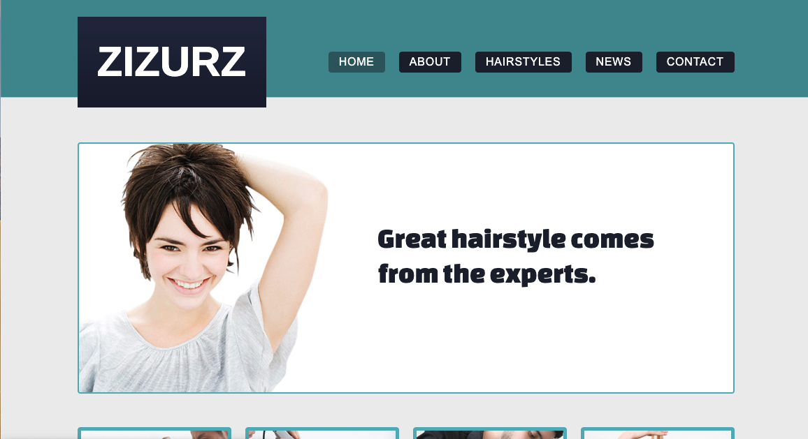

[hairstyle salon](https://freewebsitetemplates.com/preview/hairstylesalon/index.html)

Baue diese Website nach. Versuche Sie nach Möglichkeit responsive zu implementieren. Überlege dir hierzu vorher, wie die Website auf einem Tablet und Handy aussehen könnte. 

Überlege auch, ob du mobile first oder desktop first vorgehst.

**Beachte**: 
* Realisiere auch alle Unterseiten, die über das Menü erreichbar sind
* Der obere Teil "FREE WEBSITE TEMPLATES" gehört nicht zur Seite dazu
* Erstelle zusätzlich für mindestens zwei Menüpunkte eine Sub-Navigation mit drei Unterpunkten (Dropdown Menü)
* Baue mindestens eine Animation ein und verwendete transitions (z.B. beim Hovern über das Menü)