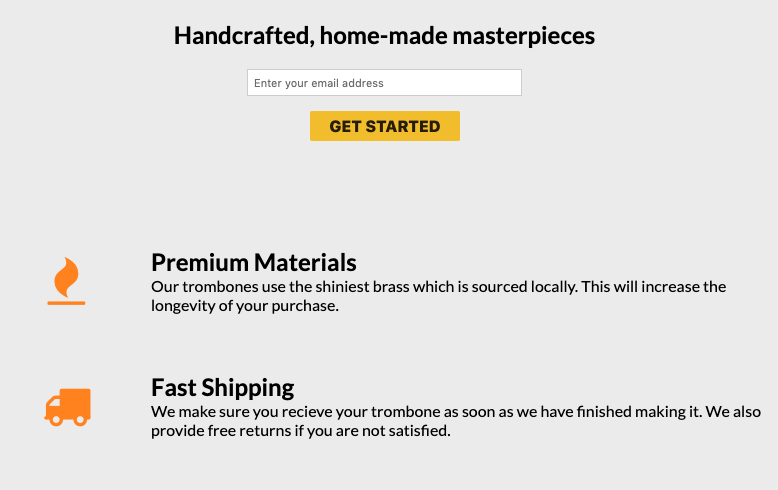

[Landing Page Trombones](https://codepen.io/freeCodeCamp/full/RKRbwL)

Baue diese responsive Website nach. 

Überlege auch, ob du mobile first oder desktop first vorgehst.

**Hinweisw**: 

* Der obere Teil "FCC: Product Landing Page" und das grüne Hamburger Menü oben links gehören NICHT zur Seite!
* Der "GET STARTED" Button soll keine Funktion haben

**Bonus**

* Verwende einen "website color scheme generator" (z. B. https://coolors.co/app) und mach die Website farblich schöner
