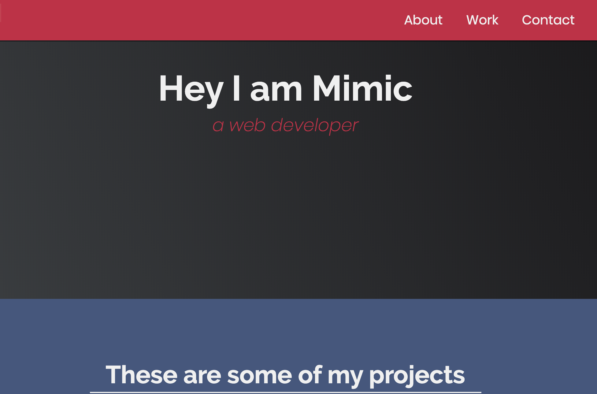

Es geht um folgende Website (bitte Link anklicken, um Seite zu sehen): [Personal Portfolio](https://codepen.io/freeCodeCamp/full/zNBOYG)

Baue diese responsive Website nach. 

**Hinweise**: 

* Überlege dir, ob du mobile first oder desktop first vorgehen möchtest.
* Der obere Teil "FCC: Personal Portfolio" und das grüne Hamburger Menü oben links gehören NICHT zur Seite!
* Der "Show all >" Button (ganz unten) hat zunächst keine Funktion
* Die menu items (About Work Contact) sollen ebenfalls zunächst keine Funktion haben
* Speichere die Fotos der Vorlage in einem assets Ordner und binde sie in deine Website ein
* Versuche flexbox und css grid zu verwenden
* Beachte, dass die Menüleiste fixed ist

**Bonus**:
 
* Baue im Header ein passendes Hintergrundbild ein
* Der "Show all >" Button (ganz unten) soll drei weitere Projekte eurer Wahl einblenden lassen, wenn er angeklickt wird. Außerdem soll sich sein Text zu "Show less <" ändern. **Tipp:** Wahrscheinlich brauchst du hierzu JavaScript :)
* Gib deinen menu items (About Work Contact) die selbe Funktion, wie sie die Vorlage hat (smooth scrolling)