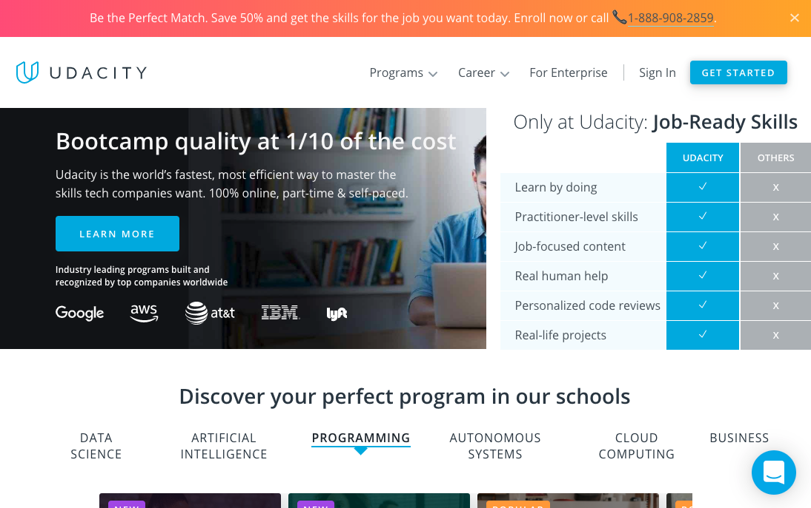

**Level der Aufgabe: Fortgeschritten!**

Es geht um folgende Website (bitte Link anklicken, um Seite zu sehen): [udacity](https://www.udacity.com/)

Baue die **Startseite** dieser Website nach. 

**Hinweise**: 

* Überlege dir, ob du mobile first oder desktop first vorgehen möchtest.
* Implementiere erst die Dinge, die dir leicht fallen
* Den Slider (Section "Discover your perfect program in our schools") kannst du zunächst gerne ohne das obere Menü (DATA SCIENCE, ARTIFICIAL INTELLIGENCE, PROGRAMMING ...) realisieren

**Bonus**:
 
* implementiere folgende Unterseiten: https://www.udacity.com/career-services & https://www.udacity.com/hire-talent